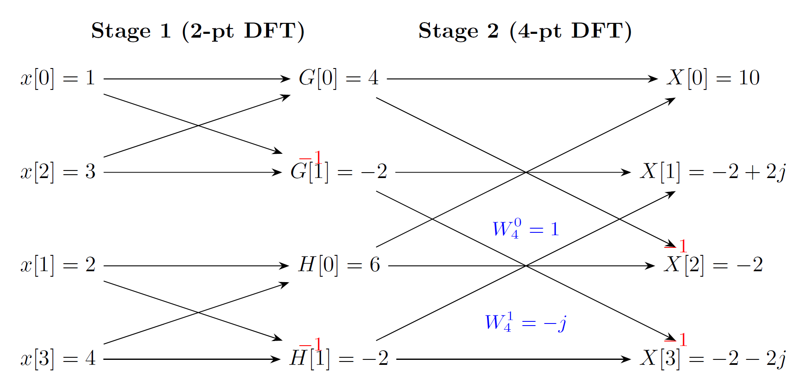

# 03 离散傅里叶变换

## 一、知识点讲解

### 1. 离散时间信号的频域表示

#### 1.1 离散时间傅里叶变换（DTFT）

对于离散时间信号 $x[n]$（通常为非周期序列），其傅里叶变换定义为：

$$
X(e^{j\omega}) = \sum_{n=-\infty}^{\infty} x[n] e^{-j\omega n}
$$

这里 $\omega$ 是连续频率变量（单位为弧度）， $X(e^{j\omega})$ 是以 $2\pi$ 为周期的复函数。反变换为：

$$
x[n] = \frac{1}{2\pi} \int_{-\pi}^{\pi} X(e^{j\omega}) e^{j\omega n} d\omega
$$

- **物理意义**： $X(e^{j\omega})$ 表示序列 $x[n]$ 中频率为 $\omega$ 的复指数分量的密度。由于离散时间信号的频率只在 $[-\pi,\pi]$ 区间内唯一表示（更高的频率会折叠到该区间），因此频谱以 $2\pi$ 为周期。

- **常见例子**：矩形窗序列

$$
x[n]=\begin{cases}1, & 0\le n\le L-1 \\\\ 0, & \text{otherwise}\end{cases}
$$

其 DTFT 为：

$$
X(e^{j\omega}) = e^{-j\omega(L-1)/2} \frac{\sin(\omega L/2)}{\sin(\omega/2)}
$$

该结果与连续矩形脉冲的 $\mathrm{sinc}$ 形状类似，但分母是 $\sin(\omega/2)$，体现了离散性。

#### 1.2 DTFT 的性质

（1）**线性**：

$$
a x_1[n] + b x_2[n] \leftrightarrow a X_1(e^{j\omega}) + b X_2(e^{j\omega})
$$

（2）**时移**：

$$
x[n-n_0] \leftrightarrow e^{-j\omega n_0} X(e^{j\omega})
$$

（3）**频移**：

$$
e^{j\omega_0 n} x[n] \leftrightarrow X(e^{j(\omega-\omega_0)})
$$

（4）**卷积**：

$$
x_1[n] * x_2[n] \leftrightarrow X_1(e^{j\omega}) X_2(e^{j\omega})
$$

（5）**调制**：

$$
x_1[n] x_2[n] \leftrightarrow \frac{1}{2\pi} \int_{-\pi}^{\pi} X_1(e^{j\theta}) X_2(e^{j(\omega-\theta)}) d\theta
$$

这些性质与连续傅里叶变换相似，但积分限变为 $[-\pi,\pi]$，周期为 $2\pi$。

---

### 2. 傅里叶变换的四种情形

根据信号在时域和频域是否连续、是否周期，存在四种经典的傅里叶变换形式：

| 信号类型 | 时域 | 频域 | 变换名称 |
|----------|------|------|----------|
| 连续、非周期 | 连续 | 非周期 | 连续时间傅里叶变换（CTFT） |
| 连续、周期 | 连续 | 离散（谱线） | 傅里叶级数（CFS） |
| 离散、非周期 | 离散 | 连续周期 | 离散时间傅里叶变换（DTFT） |
| 离散、周期 | 离散周期 | 离散周期 | 离散傅里叶级数（DFS） |

- **CTFT**：我们之前学习的 $F(\omega)=\int_{-\infty}^{\infty}f(t)e^{-j\omega t}dt$。
- **CFS**：周期连续信号 $f(t)$ 展开为 $f(t)=\sum_{k=-\infty}^{\infty} C_k e^{j k\omega_0 t}$，其中 $C_k$ 为离散谱。
- **DTFT**：即本节第一部分， $X(e^{j\omega})$ 是 $\omega$ 的连续周期函数。
- **DFS**：这一情形需要时域和频域都进行采样。时域上只看离散样点，且序列按周期重复；频域上也只在离散频率点取值，不再出现连续频率变量，不需要积分，主要使用有限求和。这种形式和数字系统的实际计算最接近：输入是有限精度样点，输出也是一组离散频率样点。对于周期为 $N$ 的离散序列 $\tilde{x}[n]$，其傅里叶级数为 $\tilde{x}[n] = \frac{1}{N} \sum_{k=0}^{N-1} \tilde{X}[k] e^{j 2\pi k n / N}$，其中 $\tilde{X}[k]$ 是周期也为 $N$ 的离散谱。DFS 是 DFT 的理论基础。

从这四种情形可以看出两条主线：第一条是“连续或离散”，决定时域和频域变量是积分还是求和；第二条是“周期或非周期”，决定对应谱是离散谱线还是连续函数。

---

### 3. 离散傅里叶变换（DFT）

在实际计算中，我们只能处理有限长的序列，且要求频域也离散化，以便计算机实现。**离散傅里叶变换（DFT）** 正是将有限长序列映射到有限长频域序列的数学工具。

#### 3.1 从周期序列的 DFS 到有限长序列的 DFT

这里的核心思路是：DFS 本来就是处理“离散且周期”序列的成熟工具，而 DFT 的对象是“有限长离散序列”。为了把已有方法直接用起来，可以先把有限长序列在数学上视为一个周期序列的主值区间，也就是先做一次“周期化想象”，再用 DFS 推出可计算的 DFT 公式。

设 $x[n]$ 是长度为 $N$ 的有限长序列。我们将其看作某个周期序列 $\tilde{x}[n]$ 的一个周期，即：

$$
\tilde{x}[n] = \sum_{r=-\infty}^{\infty} x[n + rN]
$$

该操作称为“周期延拓”。对 $\tilde{x}[n]$ 做离散傅里叶级数（DFS），其系数为：

$$
\tilde{X}[k] = \sum_{n=0}^{N-1} \tilde{x}[n] e^{-j 2\pi k n / N}
$$

由于 $\tilde{x}[n]$ 在 $0 \le n \le N-1$ 内等于 $x[n]$，上式化为：

$$
\tilde{X}[k] = \sum_{n=0}^{N-1} x[n] e^{-j 2\pi k n / N}, \quad k=0,1,\dots,N-1
$$

定义**离散傅里叶变换（DFT）** 为：

$$
X[k] = \sum_{n=0}^{N-1} x[n] W_N^{kn}, \quad k=0,1,\dots,N-1
$$

这里 $x[n]$ 表示时域序列的第 $n$ 个样点， $X[k]$ 表示频域序列的第 $k$ 个频率样点。固定 $k$ 时，求和是在“把全部时域样点投影到第 $k$ 个离散频率基函数上”；固定 $n$ 看反变换时，则是在“把全部频率样点按权重叠加回第 $n$ 个时域样点”。因此前向变换用 $n$ 求和得到各个 $X[k]$，反向变换用 $k$ 求和得到各个 $x[n]$。两边都取 $0$ 到 $N-1$，是因为同一组长度为 $N$ 的离散样本在时域与频域中是一一对应的。

其中 $W_N = e^{-j 2\pi / N}$，称为旋转因子（twiddle factor）。其反变换（IDFT）为：

$$
x[n] = \frac{1}{N} \sum_{k=0}^{N-1} X[k] W_N^{-kn}, \quad n=0,1,\dots,N-1
$$

- **注意**：DFT 仅定义在 $0 \le n,k \le N-1$ 上，但序列和变换结果均可视为周期为 $N$ 的周期序列的一个主值区间。实际中，我们只关心这些有限长的数值。

#### 3.2 旋转因子的性质

- **周期性**： $W_N^{k+N} = W_N^k$， $W_N^{k+N/2} = -W_N^k$（当 $N$ 为偶数）
- **对称性**： $W_N^{N-k} = W_N^{-k} = (W_N^{k})^*$（共轭）
- **可约性**： $W_N^{kn} = W_{N/m}^{kn/m}$（当 $N/m$ 为整数时）

这些性质是快速傅里叶变换（FFT）的基础。

#### 3.3 DFT 的性质

（1）**线性**：

$$
\mathrm{DFT}[a x_1[n] + b x_2[n]] = a X_1[k] + b X_2[k]
$$

（2）**圆周移位**：设 $x[(n-m))_N]$ 表示将序列 $x[n]$ 向右循环移位 $m$ 位（模 $N$），则：

$$
\mathrm{DFT}[x[(n-m))_N]] = W_N^{km} X[k]
$$

这对应于时域循环移位后频域乘以旋转因子，类似于时移性质，但仅对循环移位成立。

（3）**对称性**：对于实序列 $x[n]$，其 DFT 满足共轭对称性：

$$
X[N-k] = X^*[k], \quad k=1,2,\dots,N-1
$$

特别地， $X[0]$ 是实数， $X[N/2]$ 也是实数（若 $N$ 为偶数）。利用该性质可以节省存储和计算。

（4）**圆周卷积**：两个长度为 $N$ 的序列的圆周卷积定义为：

$$
y[n] = \sum_{m=0}^{N-1} x[m] h[(n-m))_N], \quad n=0,\dots,N-1
$$

对应的 DFT 关系为 $Y[k] = X[k] H[k]$，即频域乘积对应时域圆周卷积。这与线性卷积不同：线性卷积对应的是频域乘积，但需要将序列补零至足够长，避免混叠。

---

### 4. 快速傅里叶变换（FFT）

直接计算一个 $N$ 点 DFT 需要 $N^2$ 次复数乘法和 $N(N-1)$ 次加法。每个 $X[k]$ 都要累加 $N$ 项乘积 $x[n]W_N^{kn}$，因此单个 $k$ 需要 $N$ 次复乘和 $N-1$ 次复加；共有 $N$ 个 $k$，总计就是 $N^2$ 次复乘与 $N(N-1)$ 次复加。

当 $N$ 较大时，计算量惊人。1965 年 Cooley 和 Tukey 提出的快速傅里叶变换（FFT）利用旋转因子的对称性和周期性，将计算量降至 $N \log_2 N$ 量级，极大地推动了数字信号处理的发展。

#### 4.1 基2时域抽取 FFT（DIT-FFT）

假设 $N=2^M$，将序列按奇偶分解为两个 $N/2$ 点的子序列：

$$
\begin{aligned}
x_{\text{even}}[n] &= x[2n] \\
x_{\text{odd}}[n] &= x[2n+1], \quad n=0,\dots,N/2-1
\end{aligned}
$$

则 $N$ 点 DFT 可表示为：

$$
X[k] = \sum_{n=0}^{N/2-1} x[2n] W_N^{2nk} + \sum_{n=0}^{N/2-1} x[2n+1] W_N^{(2n+1)k}
$$

利用 $W_N^{2nk} = W_{N/2}^{nk}$，得：

$$
X[k] = \sum_{n=0}^{N/2-1} x_{\text{even}}[n] W_{N/2}^{nk} + W_N^k \sum_{n=0}^{N/2-1} x_{\text{odd}}[n] W_{N/2}^{nk}
$$

记

$$
G[k]=\mathrm{DFT}_{N/2}[x_{\mathrm{even}}[n]]
$$

$$
H[k]=\mathrm{DFT}_{N/2}[x_{\mathrm{odd}}[n]]
$$

则有：

$$
X[k] = G[k] + W_N^k H[k], \quad k=0,\dots,N/2-1
$$

符号看起来变多，但本质没有变： $X[k]$、 $G[k]$、 $H[k]$ 都是“某个序列在第 $k$ 个频率点的频域样值”。区别只在于序列长度不同， $X[k]$ 对应原始 $N$ 点序列， $G[k]$ 和 $H[k]$ 对应拆分后的两个 $N/2$ 点子序列。

对于 $k = N/2, \dots, N-1$，利用 $W_N^{k+N/2} = -W_N^k$ 和 $G[k+N/2] = G[k]$， $H[k+N/2] = H[k]$，得：

$$
X[k+N/2] = G[k] - W_N^k H[k], \quad k=0,\dots,N/2-1
$$

FFT 的递归也不是随意分块，而是先按奇偶抽取：例如原序列下标按 $0,1,2,3,4,5,6,7$ 排列时，先分成 $0,2,4,6$ 与 $1,3,5,7$，再把前者继续分为 $0,4$ 与 $2,6$，后者继续分为 $1,5$ 与 $3,7$。每往下一层，问题规模减半，但计算目标始终是同一类“求各频率样点的加权和”。

这就是基2 FFT 的“蝶形”运算单元，每次只需一次复数乘法（乘以 $W_N^k$）和两次复数加减法。通过递归分解，最终整个 $N$ 点 DFT 的计算量约为 $\frac{N}{2} \log_2 N$ 次复数乘法。

#### 4.2 FFT 应用实例

- **同时计算两个实序列的 DFT**：设 $x[n]$、 $y[n]$ 为两个实序列，构造 $g[n] = x[n] + j y[n]$。计算 $G[k] = \mathrm{DFT}[g[n]]$，则

$$
X[k]=\frac{G[k]+G^{*}[N-k]}{2}
$$

$$
Y[k]=\frac{G[k]-G^{*}[N-k]}{2j}
$$

利用共轭对称性，一次 FFT 即可得到两个实序列的 DFT。

- **IFFT**：只需将旋转因子改为 $W_N^{-kn}$，并除以 $N$，同样可用 FFT 算法快速计算。

---

## 二、例题讲解

### 例题1：直接计算 DFT

**题目**  
已知序列 $x[n] = \{1, 2, 3, 4\}$（ $n=0,1,2,3$ ），求其 $4$ 点 DFT $X[k]$。

**参考答案**  
根据 DFT 定义， $N=4$， $W_4 = e^{-j 2\pi/4} = e^{-j\pi/2} = -j$。

$$
X[k] = \sum_{n=0}^{3} x[n] W_4^{kn} = \sum_{n=0}^{3} x[n] (-j)^{kn}
$$

分别计算 $k=0,1,2,3$：

- $k=0$：

$$
X[0] = 1+2+3+4 = 10
$$

- $k=1$：

$$
X[1] = 1\cdot 1 + 2\cdot (-j)^1 + 3\cdot (-j)^2 + 4\cdot (-j)^3 = 1 - 2j + 3(-1) + 4(j) = 1 - 2j -3 + 4j = -2 + 2j
$$

- $k=2$：

$$
X[2] = 1 + 2\cdot (-j)^2 + 3\cdot (-j)^4 + 4\cdot (-j)^6 = 1 + 2(-1) + 3(1) + 4(-1) = 1 -2 +3 -4 = -2
$$

- $k=3$：利用对称性 $X[3] = X^*[1] = -2 - 2j$（也可直接计算验证）

因此：

$$
X[k] = \{10,\ -2+2j,\ -2,\ -2-2j\}
$$

---

### 例题2：圆周卷积与 DFT 的关系

**题目**  
设两个长度均为 $4$ 的序列 $x[n] = \{1, 1, 1, 1\}$， $h[n] = \{1, 2, 3, 4\}$，求它们的圆周卷积 $y[n] = x[n] \circledast h[n]$（模 $4$ ），并验证频域乘积等于圆周卷积的 DFT。

**参考答案**  
圆周卷积定义为：

$$
y[n] = \sum_{m=0}^{3} x[m] h[(n-m))_4]
$$

计算各 $n$：

- $n=0$：

$$
y[0] = \sum_{m=0}^{3} x[m] h[(-m))_4] = 1\cdot h[0] + 1\cdot h[3] + 1\cdot h[2] + 1\cdot h[1] = 1+4+3+2 = 10
$$

- $n=1$：

$$
y[1] = \sum_{m=0}^{3} x[m] h[(1-m))_4] = 1\cdot h[1] + 1\cdot h[0] + 1\cdot h[3] + 1\cdot h[2] = 2+1+4+3 = 10
$$

- $n=2$：

$$
y[2] = \sum_{m=0}^{3} x[m] h[(2-m))_4] = 1\cdot h[2] + 1\cdot h[1] + 1\cdot h[0] + 1\cdot h[3] = 3+2+1+4 = 10
$$

- $n=3$：

$$
y[3] = \sum_{m=0}^{3} x[m] h[(3-m))_4] = 1\cdot h[3] + 1\cdot h[2] + 1\cdot h[1] + 1\cdot h[0] = 4+3+2+1 = 10
$$

故 $y[n] = \{10,10,10,10\}$。

现在计算 DFT：

- 对 $x[n]$ 做 $4$ 点 DFT：

$$
X[0] = 4,\quad X[1] = 0,\quad X[2] = 0,\quad X[3] = 0
$$

- 对 $h[n]$ 做 $4$ 点 DFT（由例题1结果）：

$$
H[0] = 10,\quad H[1] = -2+2j,\quad H[2] = -2,\quad H[3] = -2-2j
$$

则 $Y[k] = X[k] H[k]$ 得：

$$
Y[0] = 4\times 10 = 40,\quad Y[1] = 0,\quad Y[2] = 0,\quad Y[3] = 0
$$

对 $Y[k]$ 做 IDFT：

$$
y[n] = \frac{1}{4} \sum_{k=0}^{3} Y[k] W_4^{-kn} = \frac{1}{4} \cdot 40 = 10
$$

与圆周卷积结果一致。验证了时域圆周卷积对应频域乘积。

---

### 例题3：基2 FFT 的蝶形计算

**题目**  
给定 $N=4$ 点序列 $x[0]=1$， $x[1]=2$， $x[2]=3$， $x[3]=4$，用基2 时域抽取 FFT 算法计算 $X[k]$，画出蝶形图并说明每步结果。

**参考答案**  
（1）按奇偶分解：

$$
x_{\text{even}}[n] = x[0]=1,\ x[2]=3
$$

$$
x_{\text{odd}}[n] = x[1]=2,\ x[3]=4
$$

（2）计算 $2$ 点 DFT：

$$
G[0] = 1+3 = 4,\quad G[1] = 1-3 = -2
$$

$$
H[0] = 2+4 = 6,\quad H[1] = 2-4 = -2
$$

（3）计算旋转因子 $W_4^0=1$， $W_4^1 = e^{-j\pi/2} = -j$。

（4）蝶形运算（ $k=0,1$ ）：

$$
X[0] = G[0] + W_4^0 H[0] = 4 + 6 = 10
$$

$$
X[1] = G[1] + W_4^1 H[1] = -2 + (-j)(-2) = -2 + 2j
$$

$$
X[2] = G[0] - W_4^0 H[0] = 4 - 6 = -2
$$

$$
X[3] = G[1] - W_4^1 H[1] = -2 - (-j)(-2) = -2 - 2j
$$

结果与直接计算一致。蝶形图示意如下：

实际上，每个蝶形单元包含两次加减和一次复数乘法。通过这种分解，计算量从 $4^2=16$ 次复数乘法减少为 $4$ 次（这里实际只用了两次复数乘法，因为 $W_4^0=1$ 可忽略）。
