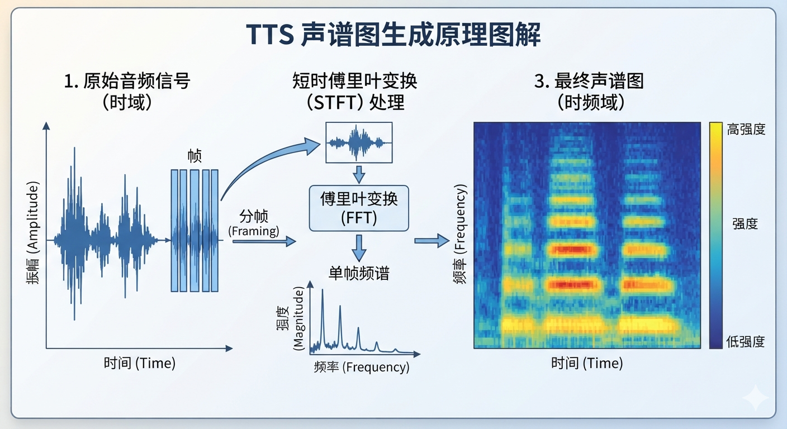
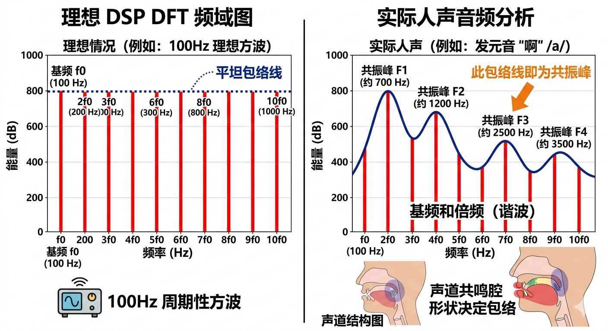
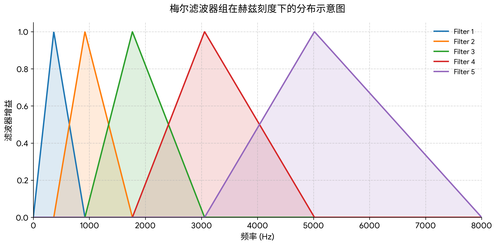
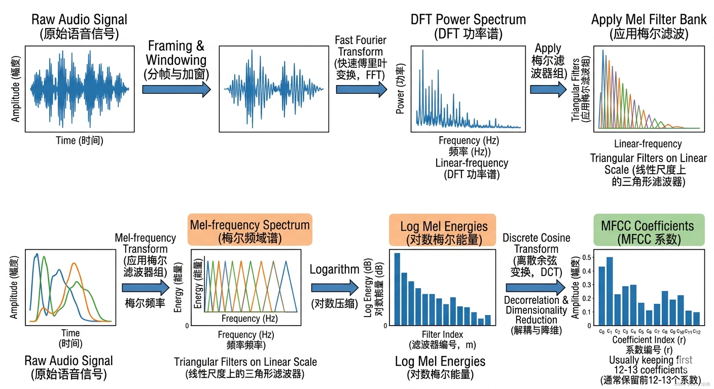

# 我是语音

## 前言

语音与声音生成是一个兼具基础性与前沿性的领域。初学时，读者往往会同时接触语音信号、声学特征、语音合成、说话人建模、对话语音生成、音色控制、环境音效以及大模型等多种内容，容易在传统方法、现代模型与实际应用之间感到割裂。因此，学习这一领域时，既需要理解基础概念和经典问题，也需要逐步建立起从语音处理到声音生成、从单句合成到复杂交互场景之间的联系。

本资料面向第一次接触语音与声音生成的初学者，旨在帮助读者根据这一领域的主要内容建立较为清晰的知识框架，理解基本概念、常见任务、核心方法与现代发展方向，并在后续学习、整理与查阅时能够较为顺畅地使用相关内容。资料既可作为入门材料，也可作为系统梳理知识时的参考。

---

## 第一课 从声音到语音生成

### 本课概要

这一课不急着进入具体模型，而是先建立一个整体认识：语音与声音生成究竟在研究什么，声音在计算机中是怎样被表示的，这个领域中常见的任务彼此有什么区别，以及学习这一方向时最应该先建立哪些基本坐标。读完这一课后，读者应当能够分清“语音”“声音”“音效”“语音生成”“对话语音生成”等概念，理解后续课程为什么既会涉及信号处理，也会涉及大模型与生成建模。

### 1.1 研究的主题

很多人第一次接触这一领域时，最容易产生的误解，是把它简单理解成“让机器开口说话”。这种理解当然不算错，但它太窄了。更准确地说，语音与声音生成研究的是：怎样让计算机理解、表示、控制并生成各种与声音有关的内容，其中既包括人说话时的语音，也包括环境音、音效、角色声音、多人对话，甚至还包括实时交互中一整段连续声音的组织方式。

如果只从人类直觉出发，我们会觉得“声音”是一个整体。但对计算机来说，声音并不是一个天然清楚的对象，而是一串随时间变化的信号。人的一句话、两个人的对话、雨声、脚步声、键盘声、爆炸声，从物理层面看都可以理解为某种声波；只是其中有些携带语言信息，有些不携带语言信息，有些强调内容本身，有些强调情绪、语气和氛围。因此，在更现代的视角里，人们往往不再把“语音合成”和“音效生成”看成完全隔绝的两个世界，而更愿意把它们看作“声音生成”这个更大主题中的不同子任务。

沿着这个思路往下看，就会发现这个领域并不只做一种事情。最传统的任务是**文本转语音**，也就是给定一段文字，让机器把它自然地读出来。再往前一步，会出现**语音到语音**的任务，即输入是一段语音，输出仍然是一段语音，但其中可能包含说话风格转换、情绪变化、角色变化、语言变化，或者对话系统产生的新回复。再进一步，如果不再只关心单人朗读，而开始关心播客、访谈、剧情配音、虚拟角色互动等场景，那么模型就必须处理多人交替说话、连续上下文、语气衔接和情境一致性。这样一来，任务就从“生成一段声音”进一步变成“组织一整段有结构的声音内容”。

因此，语音与声音生成并不是某一个模型名称，也不是某一门单独的小技术。它更像一个交叉地带：一头连着数字信号处理，一头连着机器学习和生成模型，中间还穿过语言、声学、说话人特征、实时系统和工程部署。后面学习时，读者会不断看到这些线索交织在一起。

### 1.2 声音在计算机里怎样存在

既然研究对象是声音，那么第一步就必须回答一个很基础的问题：计算机里的声音到底是什么。人耳听到的是连续变化的声波，而计算机能够处理的却是离散数据。因此，声音进入计算机以后，通常会先被表示为一串按时间顺序排列的采样值，也就是常说的**波形**（waveform）。

如果把连续时间的声音信号记为 $x_{c}(t)$ ，那么采样后的离散信号可以写成：

$$
x[n] = x_{c}(nT_{s}), T_{s} = \frac{1}{f_{s}}
$$

这里， $f_{s}$ 表示采样率， $T_{s}$ 表示采样间隔， $n$ 表示第几个采样点。这个式子本身并不复杂，但它非常重要，因为它提醒我们：计算机处理声音时，面对的不是“一个完整的句子”这种人类层面的对象，而是大量密集排列的数字。

例如，若采样率是 $16 \text{kHz}$ ，就表示每秒记录 16000 个采样点；若采样率是 $24 \text{kHz}$ ，则每秒记录 24000 个采样点。采样率越高，通常保留的细节越丰富，但存储和计算开销也更大。除了采样率，另一个常见概念是振幅，也就是每个采样点的数值大小，它对应某一时刻声波的强弱变化。于是，所谓一段音频文件，从本质上说就是“采样率 + 一长串振幅序列”。

不过，真正做分析时，人们很少直接把整段几秒、几十秒甚至几分钟的波形一口气拿来处理。原因很简单：声音虽然整体很长，但它在很短的局部时间里往往可以近似看成比较稳定。于是，一个非常重要的思想就出现了，这就是**分帧**。所谓分帧，就是把一整段音频切成很多很短的小片段，例如每帧 20 毫秒、25 毫秒或 30 毫秒，相邻帧之间再有一定重叠。这样做以后，我们就能在每一小段上分析能量、频率成分、周期性、共振峰等特征。

这件事的意义非常大。它意味着后续无论是传统语音处理中的短时傅里叶变换、梅尔频谱，还是现代模型里的音频 tokenizer、离散音频 token，本质上都建立在一个共同前提之上：**声音是随时间展开的，而有效建模往往要同时兼顾局部片段和长程上下文。** 这也是为什么语音方向既离不开傅里叶分析和数字信号处理，又会自然走向序列建模和大模型。

### 1.3 语音、对话、音效，到底是几类什么任务

在真正进入模型之前，还必须先把几个容易混淆的任务区分清楚。否则，读者很容易把很多术语混在一起，最后感觉所有东西都像“生成声音”，却又说不清彼此差别。

第一类是**文本转语音**。它的输入是文字，输出是语音。最经典的问题是：给定一句话，怎样让机器读得清楚、自然、稳定，并且像某个特定说话人。这里最关注的是发音准确、音色相似、韵律自然和长文本稳定性。

第二类是**对话语音生成**。它不再只是读一段文字，而是需要处理多人轮流说话、角色区分、情绪切换、上下文衔接等问题。若只把每一句单独合成，再简单拼接，往往会显得机械，因为真实对话中的停顿、重音、情绪推进和角色互动都不是孤立存在的。于是，这类任务更强调“连续对话场景中的整体一致性”。

第三类是**音色与角色控制**。这里的重点不是“说什么”，而是“以什么样的声音去说”。同一句话，温和地说、播音腔地说、带笑意地说、像某个角色那样说，给人的感受完全不同。因此，现代系统往往会强调说话人建模、风格控制、情绪控制，甚至支持零样本音色克隆。

第四类是**音效与环境音生成**。这类任务未必有明确的语言内容，但依然属于声音生成的重要部分。雨声、风声、办公室背景声、键盘声、脚步声、爆炸声，都属于这一路线。它和语音生成的区别在于，前者未必强调语义内容和发音单位，而更强调声学纹理、时序结构和场景氛围。

第五类是**实时语音交互**。如果一个系统要像语音助手一样边听边答，那么“能不能生成高质量语音”还不够，还必须关心首包延迟、流式输出、上下文缓存、实时推理效率等工程问题。很多离线效果不错的模型，一旦放进实时场景，就会暴露出完全不同的瓶颈。

把这些任务放在一起看，就能理解为什么现代系统常常会出现一个“家族化”的形态。因为单一模型很难同时把长文本朗读、多人对话、角色声音设计、环境音效、实时流式交互都做到最好。于是，人们会围绕一套共享的表示和建模思想，发展出面向不同场景的子模型或子系统。理解这一点之后，再去看各种模型名称，就不会觉得它们只是杂乱堆在一起的功能列表了。

### 1.4 学这一方向时需要建立的基础

既然这个领域横跨很多内容，那么学习时就特别容易迷路。为了避免一开始就被大量名词淹没，更好的办法是先给自己建立一张简单而稳定的知识地图。对初学者来说，我们至少要先建立下面四层认识。

第一层，是**信号层**。也就是声音作为时间信号时，它有哪些基本属性。采样率、时长、帧、频谱、能量、基频、谐波、共振峰，这些概念共同决定了“声音是什么”。如果这一层不清楚，后面看到声学特征和声码器时就会很吃力。

第二层，是**语言与声学层**。语音不是普通噪声，它背后有发音、音节、音素、停顿、语调、韵律等结构。哪怕后面的模型已经不再严格依赖人工设计规则，这些结构仍然会以某种形式存在于数据和表示之中。也就是说，模型可以把很多中间过程“学进去”，但学习者自己不能因此假装这些层次不存在。

第三层，是**表示与建模层**。现代语音生成系统越来越强调把音频压缩成某种离散或连续表示，再在这些表示上做序列建模。这里就会出现音频 tokenizer、离散 token、自回归生成、上下文长度、流式推理、多说话人建模等问题。这一层最接近现代大模型语境，也是后续理解新系统时最关键的一层。

第四层，是**工程与评测层**。真实系统不仅要“能生成”，还要看是否稳定、是否自然、是否延迟低、是否能部署、是否能控制、是否容易失真。研究论文和真实产品之间，常常差的不是一句“把模型再做大一点”，而是这一层里的大量工程细节。

如果把这四层连起来，整件事就会清楚很多。语音与声音生成并不是“先学点声学，再随便套个大模型”这么简单；也不是“只要会 Transformer 就能自然搞定音频”。它更像是一座桥：桥的一端是声音信号的物理与数学基础，桥的另一端是现代生成模型与真实交互系统。接下来，我们就会沿着这座桥一步步展开。

### 本课小结

这一课最重要的目标，并不是记住很多术语，而是先把这个领域的全貌看清楚。声音进入计算机以后，本质上是按时间展开的离散信号；语音只是声音中的一种特殊类型，但现代系统往往会把语音、对话语音、角色声音、环境音效和实时交互放在一个更大的声音生成框架下统一考虑。学习这一方向时，必须同时建立信号、语言与声学、表示与建模、工程与评测这几层认识。后面的内容，基本都会在这几层之间来回穿梭。

## 思考与练习

1. 判断题：语音与声音生成的研究对象只有“机器朗读文本”，因此环境音和音效不属于这一领域。

2. 简答题：为什么处理语音时，常常不会直接拿整段长波形一次性分析，而要先进行分帧？

3. 简答题：文本转语音、对话语音生成、音效生成这三类任务，最核心的区别分别是什么？

## 参考解答

1. 错。现代语音与声音生成的范围已经明显超出了“把文字读出来”这一件事。除了单人语音合成之外，它还包括多人对话语音、角色声音设计、环境音与音效生成，以及实时语音交互等方向。从更大的视角看，它研究的是各种声音内容的表示、控制与生成。

2. 因为整段长波形随时间变化很快，直接整体分析通常既不方便，也不符合语音的局部稳定特性。把音频切成较短的帧以后，可以在每一小段上提取局部特征，再进一步组织成长时间结构。许多传统方法和现代模型，都是在“局部片段 + 长程上下文”这个思路上建立起来的。

3. 文本转语音的核心是“给定文字，生成自然语音”，重点在发音、音色、韵律和稳定性；对话语音生成更强调多人互动、上下文连续性、角色区分和对话节奏；音效生成则不一定有明确语言内容，重点更偏向声学纹理、场景氛围和非语言声音的结构。三者都属于声音生成，但关注的对象和约束并不完全相同。

## 第二课 语音的时间结构与频率结构

### 本课概要

第一课已经说明，语音在计算机里首先表现为一串随时间排列的采样值。但如果只停留在波形层面，许多真正重要的信息仍然很难直接看出来。这一课要讨论的，正是语音分析中最根本的一步：为什么仅看时间波形往往不够，为什么还要看频率结构，为什么语音处理几乎总要分帧，频谱、声谱图、梅尔尺度这些概念又是怎样自然出现的。读完这一课后，读者应当能够建立起一个基本认识：语音既有时间上的变化，也有频率上的组织，而后续许多特征与模型，实际上都建立在这种双重结构之上。

### 2.1 从时域到频域

在程序设计中，我们很熟悉“原始数据”和“更适合分析的表示”这两个层次。语音也是如此。波形是最原始、最直接的表示，它记录了每一个采样时刻的振幅，因此保留了声音最完整的信息。但是，正因为它太原始了，所以在很多时候反而不容易直接使用。

例如，假设我们面前有两段语音，一段是元音“a”，另一段是元音“i”。如果只把两段波形画出来，当然能看见它们在振幅上的起伏不同，但仅凭肉眼往往很难立刻说清：它们在频率成分上有什么差异，为什么听起来一个更“开口”，另一个更“尖细”，以及哪些成分真正决定了音色。再比如，同一句话由不同的人说出来，波形几乎不可能一样；即使是同一个人重复说两遍，波形也不会严格重合。由此可见，波形虽然完整，却不总是“可解释”。

问题的根源在于，语音不是单一频率的简单振动，而是许多不同频率成分叠加起来的结果。我们学习过 DSP 课程后就会知道，复杂信号可以分解为不同频率的分量，而这些分量的强弱分布，往往比单纯的波形起伏更能揭示信号的内在结构。对语音来说，尤其如此。人之所以能分辨不同元音、不同说话人、不同音色，很大程度上正是因为各个频段中的能量分布不同。

因此，从波形走向频谱，并不是因为波形“没用”，而是因为频率结构往往更接近人们真正关心的问题。

设离散语音信号为 $x[n]$ ，其中 $n$ 表示采样点下标。若只在时间域观察，我们看到的是信号随时间如何起伏；若转到频率域观察，我们更关心“这个信号由哪些频率构成，以及各自强弱如何”。对于离散信号，最基本的工具是离散傅里叶变换（discrete Fourier transform, DFT）：

$$
X[k] = \sum_{n=0}^{N-1} x[n] e^{-j \frac{2 \pi}{N} kn}
$$

这里， $N$ 表示分析窗口内的采样点数， $k$ 表示频率下标， $X[k]$ 是第 $k$ 个离散频率点上的复数频谱值。这个式子表面上只是一次求和，但它所表达的意义非常重要：它把一段长度为 $N$ 的离散信号，重新表示成了若干个离散频率分量的组合。

在实际分析中，人们通常不会直接盯着复数频谱本身，而更常看它的模长，或者模长平方。前者常被称作**幅度谱**（magnitude spectrum），后者常被称作**功率谱**（power spectrum）。若记频谱模长为 $|X[k]|$ ，则功率谱常写为：

$$
P[k] = |X[k]|^{2}
$$

幅度谱告诉我们，各个频率成分“有多强”；功率谱则更强调能量分布。对语音而言，这类信息很重要，因为人类发声并不是随机地在所有频率上平均发力，而是会在某些频段更强、某些频段更弱。换句话说，语音的很多可辨识特征，都体现在频谱形状上。

不过，这里有一个必须立刻意识到的问题。傅里叶变换最擅长分析“整体上比较稳定”的信号，而语音却恰恰是不断变化的。人说一句话时，音素在变，口型在变，能量在变，基频也可能在变。如果把整句话一次性做傅里叶变换，我们得到的只是一个把所有时间信息混在一起的频谱。这个频谱当然也有价值，但它已经看不清语音在时间上的局部变化了。

因此，语音分析既不能只看时间域，也不能只看整个信号的一次频域变换。它真正需要的是一种折中方法：在较短的时间范围内观察频率结构，并随着时间向前滑动。这就自然引出了短时分析。

### 2.2 短时分析与分帧

语音处理中一个最重要的经验事实是：虽然整段语音是不断变化的，但在很短的局部时间范围内，它常常可以近似看成平稳。所谓“平稳”，这里不是指它绝对不变，而是指在几十毫秒这样的小窗口里，其统计性质和频谱结构变化不至于太剧烈。正因为有这个近似成立，分帧才成为语音分析的基础步骤。

所谓**分帧**，就是把一段语音切成许多短片段，每一帧单独分析。常见帧长大约在 20 毫秒到 30 毫秒之间，帧移则常取 10 毫秒左右。帧长决定每次分析覆盖多长时间，帧移决定相邻两帧之间前进多少。帧移小于帧长，就意味着相邻帧之间有重叠，这样可以让特征随时间的变化更平滑，也不容易遗漏边界信息。

仅仅把信号切成帧还不够。每一帧在做傅里叶变换前，通常还会乘上一个**窗函数**（window）。这是因为直接截断信号会引入边界不连续，从而带来频谱泄漏。常见的窗函数有汉明窗（Hamming window）、汉宁窗（Hann window）等。若一帧信号记为 $x_{m}[n]$ ，窗函数记为 $w[n]$ ，那么加窗后的帧可写成：

$$
\hat{x}_{m}[n] = x_{m}[n] w[n]
$$

这里下标 $m$ 表示第 $m$ 帧。加窗的直观理解是：让一帧中间部分权重大一些，边界部分平滑地衰减下去，从而避免“硬切一刀”带来的频域假象。

接着，对每一帧分别做傅里叶变换，就能得到这一帧的频谱。若把所有帧按时间顺序排开，再把每一帧中不同频率位置的强度用颜色或灰度表示，就得到了非常重要的图像：**声谱图**（spectrogram）。声谱图的横轴是时间，纵轴是频率，颜色深浅表示强弱。到这里，语音的“双重结构”才第一次比较清楚地呈现出来：同一时刻上，不同频率的能量分布不同；沿着时间往前看，这些分布又不断演化。

为什么声谱图如此重要？因为它恰好兼顾了时间和频率。只看波形，频率结构不明显；只看整段频谱，时间结构又被抹平。声谱图介于二者之间，因此成为后续很多语音特征和模型的出发点。哪怕在现代深度学习与大模型系统中，许多中间表示也仍然保留着这种“时间轴 + 频率轴”的思想。

### 2.3 语音中的几个关键量

当我们开始从短时频谱角度看语音时，有几个概念会频繁出现，它们并不是孤立的术语，而是对语音结构的不同侧面进行刻画。

第一是**能量**。能量反映一小段语音有多强，常常和响度变化、停顿检测、语音活动检测等任务有关。某一帧若整体能量很低，往往意味着这里接近静音、弱音或停顿；能量较高，则往往对应较清晰的发声段。

第二是**基频**（fundamental frequency, F0）。当声带振动时，语音会呈现某种周期性，基频刻画的就是这种最基本的振动频率。它和人感知到的音高密切相关。一般来说，基频高，听起来音高更高；基频低，听起来音高更低。语调变化、情绪变化、疑问句和陈述句的差异，常常都和基频轨迹有关。

第三是**谐波**。如果基频是 $F_{0}$ ，那么在理想情况下，还会在 $2F_{0}$ 、 $3F_{0}$ 、 $4F_{0}$ 等位置出现成分，这些就是谐波。它们共同塑造了声音的音色。很多有声语音段，例如元音，在频谱上就常能看到明显的谐波结构。

第四是**共振峰**（formant）。这是语音中特别重要、也特别容易让初学者一开始感到陌生的概念。简单说，声道像一个会随口型和舌位变化而改变形状的滤波器，不同的口型会增强某些频率附近的能量，于是形成一些稳定而突出的峰值区域。元音之间的主要区别，往往就体现在前几个共振峰的位置不同。也正因为如此，共振峰常被用来解释“为什么不同元音听起来不同”。

如果把这几个量放在一起看，会发现它们分别对应了语音的不同层面：能量更像整体强弱，基频和谐波更接近声源特性，共振峰更接近声道形状。后面当读者接触更复杂的模型时，会发现现代系统虽然未必显式地先算出这些量再处理，但它们所反映的结构并没有消失，而是以更隐含的方式存在于模型表示里。

### 2.4 从线性频率到梅尔频率

前面提到的频谱和声谱图，频率轴通常是线性刻度，也就是每增加同样的赫兹数值，就对应同样的轴长。但人耳对频率的感知并不是线性的。低频部分，人耳对细小变化更敏感；到了高频部分，感知分辨率就没有那么均匀了。于是，在语音处理中，人们很自然地想到：如果目标之一是让表示方式更贴近人类听觉，那么频率轴是否也应该做相应变换？

这就引出了**梅尔尺度**（Mel scale）。它是一种模拟人耳频率感知的非线性尺度。常见的近似换算公式是：

$$
m = 2595 \log_{10}\left(1 + \frac{f}{700}\right)
$$

这里， $f$ 表示以赫兹为单位的线性频率， $m$ 表示对应的梅尔频率。这个式子并不要求死记，而是提醒我们：在人类感知里，低频区的细节往往比高频区更重要，因此在语音任务中，适当压缩高频分辨率、保留低频细节，常常是一种合理选择。

基于这个思想，就会得到非常常见的表示：**梅尔频谱**（Mel spectrogram）。它的做法可以简单概括为：先对每一帧求频谱，再通过一组按梅尔尺度分布的滤波器，把线性频率轴上的能量重新汇总到若干个梅尔频带中。这样得到的表示维度更低，也更贴近人耳听觉特性，因此在语音合成、语音识别、说话人建模和声音生成中都非常常见。

在这里，梅尔滤波器组并不是电路里的那种物理滤波器，在算法上它其实是一个特殊的、三角形的“加权求和矩阵”。在低频部分，三角形很窄，密密麻麻。这意味着低频分得很细，因为人耳对低频音高变化很敏感。在高频部分，三角形变得很宽，跨越很大的频率范围。这意味着高频被粗暴合并了，因为人耳听高频很迟钝，两三千赫兹的微小变化人类根本分不清。

在滤波时，我们只需拿着第 $m$ 个三角形滤波器，罩在原始频谱图上。三角形覆盖区域内的所有原始频率点的能量，乘以三角形的高度（权重），然后全部加起来。这个加权求和得到的一个总能量数值，就是 $E_{m}$ 。

如果说普通声谱图更接近“数学分析”的直接结果，那么梅尔频谱就更像是“在声谱图基础上，往人类听觉方向做了一步加工”。它不是唯一正确的表示，但在很多实际系统中非常有用。后面当读者看到很多模型把梅尔频谱作为输入或中间目标时，就不应把它看成一个突然出现的黑箱特征，而应理解为：这是在时间结构、频率结构与听觉特性三者之间做出的折中。

### 本课小结

这一课真正想建立的，是一种观察语音的方式。语音既不是单纯的波形，也不是单纯的频率表，而是一个同时具有时间结构和频率结构的动态信号。波形保留了最原始的信息，频谱揭示了频率成分，分帧和短时分析让我们能够在时间上追踪这些成分的变化，声谱图因此成为语音分析中极为重要的中间表示。在此基础上，能量、基频、谐波、共振峰帮助我们从不同角度理解语音结构，而梅尔尺度和梅尔频谱则进一步把这种表示拉近到人类听觉的习惯。后面的很多特征提取方法和现代模型表示，实际上都建立在这里。

## 思考与练习

1. 填空题：若一段语音信号按帧处理，每帧长度为 25 毫秒，帧移为 10 毫秒，则相邻两帧之间存在 ______ 毫秒的重叠。

2. 简答题：为什么对整句语音一次性做傅里叶变换，通常不足以支撑细致的语音分析？

## 参考解答

1. 15。因为帧长是 25 毫秒，而帧移是 10 毫秒，所以相邻两帧之间的重叠长度为 $25 - 10 = 15$ 毫秒。

2. 因为整句语音是随时间不断变化的，音素、语调、能量和基频都可能在变化。若把整句语音一次性做傅里叶变换，就会把这些局部变化混合在一起，只得到一个全局频谱，而看不清不同时间段上的频率结构。语音分析真正需要的，往往是“局部时间范围内的频率信息如何变化”。

## 第三课 从声谱图到语音特征

### 本课概要

前两课已经建立了一个基本图景：语音是时间信号，分析时通常需要进入频率域，并通过分帧、加窗和短时傅里叶变换得到声谱图或梅尔频谱。但在真正的语音任务中，人们很少把原始波形或者未经处理的频谱直接送入后续系统，而是会进一步构造更适合表示和学习的**特征**（feature）。这一课要讨论的，正是“特征”这个概念为什么会出现，梅尔频谱为什么常常还要再取对数，MFCC 是怎样得到的，动态特征又在描述什么，以及现代系统为什么一方面在弱化人工特征，另一方面又没有完全脱离这些传统表示。读完这一课后，读者应当能够分清常见语音特征之间的关系，并理解它们各自想保留什么、丢掉什么。

### 3.1 特征的意义

在很多初学者看来，既然波形已经完整，声谱图也已经把时间和频率结构都展示出来了，那么为什么还要继续做“特征提取”？这个问题非常自然，而且也很关键。答案并不是“原始表示没用”，而是不同任务对表示的要求并不一样。

首先，原始波形虽然信息最全，但维度非常高，而且局部数值变化剧烈。对人类来说，一段两秒的语音似乎很短；但对计算机而言，若采样率是 $16 \text{kHz}$ ，那么这已经是 32000 个采样点。若直接在这些点上做建模，不仅计算开销大，也不容易稳定地捕捉到语音的结构规律。声谱图和梅尔频谱已经向前迈出了一步，因为它们把“变化很快的时域波形”变成了“随时间演化的频率分布”。但即便如此，频谱中的很多细枝末节，对某些任务来说仍然并不重要。

例如，若目标是识别语音内容，那么系统真正关心的，往往不是某一帧里每一个频点的精确数值，而是更宏观、更稳定的频带分布；若目标是说话人识别，那么音色结构和声道特性就比某些瞬时扰动更重要；若目标是合成语音，则既要保留整体音色与韵律信息，又要让表示足够平滑、足够可预测。换句话说，所谓特征，并不是平白无故多加一层处理，而是根据任务需要，把原始信号重新组织成更有解释力、更便于计算、更容易学习的表示。

因此，特征提取其实是在做一件很朴素的事情：尽量保留对任务有用的信息，同时适度压缩冗余和噪声。传统语音处理中，这一步往往依赖人工设计；现代深度学习系统中，这一步有时会由模型自己学出来。但无论方法如何变化，背后的思想是一样的。

### 3.2 从梅尔频谱到对数梅尔频谱

上一课已经介绍过梅尔频谱。它把线性频率轴上的功率分布，汇总到若干个按梅尔尺度安排的频带中，因此比普通频谱更贴近人耳听觉，也更紧凑。在很多任务里，梅尔频谱本身就已经是一种很好用的表示；但在实际系统中，人们又常常会再做一步：取对数，得到**对数梅尔频谱**（log-Mel spectrogram）。

为什么要取对数？一个非常重要的原因，是人对声音强弱的感知本来就不是线性的。若某个频带的能量从 1 增加到 2，人耳感知到的变化，并不一定和从 100 增加到 101 一样。对数运算可以压缩能量动态范围，让很大的值和很小的值处在更适合比较的尺度上，也让许多频带间的差异看起来更平衡。

若梅尔滤波器组输出的能量记为 $E_{m}$ ，则对数梅尔能量常写为：

$$
L_{m} = \log(E_{m})
$$

这里的下标 $m$ 表示第 $m$ 个梅尔频带。实际实现中，为了避免能量过小导致对数无定义，常常会写成：

$$
L_{m} = \log(E_{m} + \varepsilon)
$$

其中， $\varepsilon$ 是一个很小的正数，用来防止数值问题。这个式子看起来很简单，但它在语音处理中非常常见，几乎可以看成一个“标准动作”。因为在很多情况下，对数梅尔频谱比原始梅尔频谱更稳定，也更方便后续建模。

从直观上说，普通梅尔频谱像是“各频带真实能量的直接统计”，而对数梅尔频谱则像是“经过感知尺度压缩后的能量图”。后者之所以普遍，一方面是因为它更贴近听觉，另一方面也因为它能减弱极大值对整体表示的支配作用。后面无论是传统特征，还是很多现代神经网络输入，常常都能看到这一表示。

### 3.3 MFCC 的思想与来路

在传统语音处理中，一个极其经典的特征是 **MFCC**（Mel-frequency cepstral coefficients，梅尔频率倒谱系数）。这个名字初看往往让人很不舒服，因为它把“梅尔”“频率”“倒谱”“系数”几个看起来就很难亲近的词堆在了一起。其实，如果把它拆开来看，逻辑并不神秘。

首先，MFCC 的起点仍然是梅尔滤波器组，也就是说，它首先承认一个事实：直接看线性频谱并不总是最方便，按梅尔尺度重新组织频带更合理。接着，对每个梅尔频带取对数，于是得到一组对数梅尔能量。这一步的思想上一小节已经解释过。问题在于，这些对数梅尔能量之间往往彼此相关，维度也不算特别紧凑。于是，人们再做一步变换，把这些相关性较强的量重新表示为一组更紧凑的系数。这个变换通常采用离散余弦变换（discrete cosine transform, DCT）。

若对数梅尔能量记为 $L_{m}$ ，则第 $r$ 个 MFCC 系数常写成：

$$
c_{r} = \sum_{m=0}^{M-1} L_{m} \cos \left[\frac{\pi r}{M}\left(m + \frac{1}{2}\right)\right]
$$

这里， $M$ 表示梅尔滤波器个数， $r$ 表示系数编号。这个公式并不要求死记，但它至少说明了一件事：MFCC 不是从天而降的黑箱量，而是“梅尔滤波器组 + 对数压缩 + DCT”这一串操作的产物。

那为什么这组系数会有用？从经验上看，前若干个 MFCC 系数往往能较好地描述频谱包络（spectral envelope）的整体形状，而频谱包络又和声道特性、音色结构有较强关系。对于很多传统语音识别和说话人处理任务来说，这恰好是有价值的信息。与此同时，一些特别细碎、特别快速变化的频谱细节会被削弱，这相当于在一定程度上完成了压缩和去噪。

不过，MFCC 也并不是“任何场景都比梅尔频谱更先进”。在深度学习兴起之后，很多系统重新转向对数梅尔频谱，原因之一是神经网络本身有较强的表示学习能力，不一定需要人工再把频带信息压到 MFCC 里。也正因为如此，MFCC 在今天的地位更适合这样理解：它是一个非常重要的传统基线，也是一种很能体现语音特征设计思想的经典表示。即便后续任务不直接使用 MFCC，理解它为什么被设计出来，仍然非常有帮助。

### 3.4 动态特征

到这里，还存在一个自然问题。前面的特征大多是在单帧层面定义的，例如某一帧的对数梅尔频谱、某一帧的 MFCC。但语音是随时间变化的，仅仅知道“这一帧长什么样”，往往还不够。许多重要信息，并不在静态图像里，而在变化过程里。于是，动态特征就出现了。

最常见的动态特征是**一阶差分**和**二阶差分**，也常被称为 delta 和 delta-delta。它们分别用来近似描述特征随时间的一阶变化率和二阶变化率。若某一帧的静态特征向量记为 $c_{t}$ ，则一阶差分常写成一种加权差分形式：

$$
\Delta c_{t} = \frac{\sum_{n=1}^{N} n(c_{t+n} - c_{t-n})}{2 \sum_{n=1}^{N} n^{2}}
$$

这里， $t$ 表示帧编号， $N$ 表示前后参考的帧数。这个公式的本质并不复杂，它只是把当前帧前后的若干帧一起拿来，估计“这一点附近正在朝哪个方向变化”。若继续对一阶差分再做类似处理，就会得到二阶差分。

动态特征的重要性在于，它明确提醒我们：语音不是一组孤立帧的集合，而是连续演化的过程。单看某一帧的谱图，常常很难区分一些发音相近、但动态轨迹不同的情况；而一旦把前后变化趋势纳入，许多模式就会更清楚。因此，在传统系统里，经常把静态特征、一阶差分和二阶差分拼在一起，组成更完整的描述。

当然，在现代序列模型里，时间上下文往往会由卷积、循环结构或 Transformer 之类的机制直接建模，因此未必还需要显式地手工拼接 delta 特征。但这并不意味着动态特征思想失效了。相反，它只是从“人工显式构造”逐渐转向“由模型隐式学习”。理解这一点，有助于把传统特征工程和现代表示学习看成一条连续的演化线，而不是两个彼此割裂的时代。

### 3.5 传统特征与现代表示

读到这里，可能会出现一个新的疑问：既然现代大模型、编码器和表示学习如此强大，那么还需要了解这些传统特征吗？答案仍然是肯定的，因为传统特征的重要性并不只在于“今天是否还原样使用”，更在于它们把语音表示中的许多关键思想提前说清楚了。

例如，对数梅尔频谱告诉我们：频率表示通常要结合人类感知尺度；MFCC 告诉我们：好的表示往往要兼顾压缩、去冗余和可解释性；动态特征告诉我们：语音的时间变化本身就是信息。即使现代系统直接从波形学表示、直接在离散音频 token 上建模，或者用大模型统一处理多种声音任务，这些思想依然没有消失。只是它们不再总以显式公式和手工步骤出现，而是更深地融进了模型结构、训练目标和中间表示之中。

更进一步说，现代语音系统里常见的音频编码器、离散语音 token、声学前端等概念，和传统特征之间并不是完全断裂的关系。前者当然更强、更灵活，也更适合大规模数据驱动；但后者提供了一套非常清楚的理解框架，帮助人们知道：一个表示为什么有效，它究竟在强调哪些信息，又牺牲了哪些信息。对于初学者来说，这种框架尤其重要。因为一旦缺少这层理解，就很容易把后面的复杂系统全都看成不可解释的黑箱。

因此，学习传统语音特征的真正意义，并不是要永远停留在那里，而是要借此建立“如何为声音设计或理解表示”的基本判断力。后面继续学习现代语音模型时，这种判断力会不断派上用场。

### 本课小结

这一课围绕“特征”这一层展开。特征之所以出现，是因为原始波形和原始频谱虽然完整，却不总是最适合直接用于分析和建模。梅尔频谱把频率组织方式拉近到听觉尺度，对数压缩进一步平衡了能量范围，MFCC 则是在这一基础上形成的经典紧凑表示，而动态特征又补上了时间变化这一层信息。传统特征工程和现代表示学习并不是互相否定的关系，前者更像是一套清楚、可解释的基础框架，后者则是在更大数据和更强模型条件下对这些思想的延伸与重构。

## 思考与练习

1. 判断题：对数梅尔频谱相较于普通梅尔频谱的一个重要作用，是压缩能量动态范围，使表示更稳定。

2. 填空题：MFCC 的典型处理流程可以概括为“梅尔滤波器组 + ______ + DCT”。

3. 简答题：现代模型有时不再显式使用 delta 特征，这是否意味着“时间变化信息不重要了”？为什么？

## 参考解答

1. 对。对数变换的重要作用之一，就是压缩不同频带能量之间过大的数量级差异，使表示更平衡，也更贴近人对声音强弱的感知方式。

2. 对数压缩。更完整地说，是先得到梅尔频带能量，再取对数，最后做离散余弦变换得到倒谱系数。

3. 不意味着时间变化信息不重要了。恰恰相反，时间变化始终是语音的核心信息之一。现代模型往往通过上下文窗口、卷积、循环结构或注意力机制去自动学习这种变化，因此不一定还需要人工显式构造 delta 特征。也就是说，变化信息没有消失，只是表达方式发生了改变。

## 第四课 从文本到语音的生成链路

### 本课概要

前面三课主要讨论的是语音信号本身：它在时间上怎样变化，在频率上怎样组织，以及人们如何从中提取出适合分析和建模的表示。接下来，视角需要再向前推进一步。既然语音已经可以被表示、分析和学习，那么一个完整的语音生成系统，到底是怎样把一段文本逐步变成可听声音的？为什么这个过程长期以来常常要拆成若干模块？端到端语音生成又究竟想打通什么？这一课的任务，就是把这些问题讲清楚。读完本课后，读者应当能够对语音生成系统的基本链路形成较完整的印象，并理解传统级联系统与现代端到端系统分别解决了什么问题。

### 4.1 语音生成

初看这个问题，似乎答案很简单：语音生成就是“给一段文本，输出一段声音”。但如果稍微想深一点，就会发现其中包含的内容远不止“把字念出来”这么朴素。对于人类听者来说，一段自然语音至少同时承载了几层信息。

第一层是**内容信息**。也就是说，文本里写了什么，声音就要把这些字词读出来，而且不能读错、漏读、跳读。这一层最接近“语音识别的逆过程”，也是任何语音生成系统最基本的要求。

第二层是**韵律信息**（prosody）。同一句话，用不同的停顿、重音、语速和语调说出来，听感会完全不同。韵律往往决定了句子是不是自然，是不是像人在说话，而不是像一个只会逐字朗读的机器。很多初学者以为语音合成最难的是“发对音”，其实在工程实践里，真正决定听感上限的，常常是韵律。

第三层是**音色信息**（timbre）。不同的人说同一句话，文本内容可以相同，韵律也可能相似，但听起来仍然明显不是同一个人。这种区别并不主要来自词义，而来自说话人的声道特征、发声习惯和整体声音风格。音色是“谁在说”的重要线索。

第四层则是更广义的**表达信息**。例如情绪、说话场景、角色感、语气强弱，甚至包括一些并不属于语言本身的声音效果。这些因素未必总能用一句文字精确写清，却会明显影响生成结果是否自然、是否贴近目标场景。

因此，所谓语音生成，真正要做的并不是把文本“翻译成波形”，而是要把文本、韵律、音色和表达方式一起组织起来，最终生成一段既正确、又自然、还尽量符合目标风格的声音。只有在这个意义上，后面将要出现的模块划分才会显得合理。因为一个系统若要同时处理这么多层信息，就很难只靠一个简单步骤直接完成。

### 4.2 传统级联系统的意义

在相当长的一段时间里，文本到语音系统通常采用**级联**（cascade）思路。所谓级联，就是把“从文本到声音”的长链路拆成若干相对清晰的小任务，每一段只负责一部分工作。虽然不同系统的拆法不完全一样，但最典型的链路大致可以写成：

文本 $\rightarrow$ 文本前端 $\rightarrow$ 声学表示 $\rightarrow$ 波形生成

这里的“文本前端”主要处理的是文本规范化和发音相关问题。例如数字该怎么读，英文缩写怎样展开，标点对停顿会产生什么影响，同音字在具体上下文中如何消歧，句子应当如何切分。也就是说，在系统真正开始生成声音之前，文本本身往往要先变成一种更适合发音和韵律处理的形式。

接着，系统会进入声学建模阶段。传统做法并不直接从文本生成最终波形，而是先生成一个中间表示，例如梅尔频谱、对数梅尔频谱或者其他声学特征。这一步可以理解为：先决定“这段语音大致应该长成什么样”，再交给后面的模块把它真正合成为声音。

最后一步通常由**声码器**（vocoder）完成。所谓声码器，可以简单理解为“把声学表示还原成可播放波形”的模块。若前面的声学模型给出了一张频谱图，那么声码器就负责把这张“图”重新变回真正的声音。传统声码器有基于规则和信号处理的方法，后面也逐渐出现了基于神经网络的神经声码器。

为什么这种拆法长期存在？原因很直接，因为这样更容易把问题讲清楚、调试清楚，也更容易逐段优化。文本前端出问题，就先修文本前端；韵律不自然，就重点看声学模型；音质不够好，就改声码器。换句话说，级联系统虽然不够“统一”，但它具有很强的可解释性和可维护性。

不过，这种方法也有明显代价。首先，模块之间是逐级传递的，前面某一段犯的错误，后面往往很难补回来。其次，不同模块的优化目标并不总是一致的，分别训练得到的部件未必能在整体上达到最优。再次，模块越多，系统越容易变得笨重，延迟、接口和工程复杂度都会上升。因此，现代系统不断尝试把其中一些边界打通，也就很自然了。

### 4.3 文本前端、声学模型与声码器

虽然现代系统在不断追求更强的统一建模，但在理解一条语音生成链路时，文本前端、声学模型和声码器这三个名字仍然非常重要。它们不只是历史遗留概念，而是帮助理解整个系统结构的基本坐标。

先看**文本前端**。很多初学者会低估这一部分，觉得它只是做一点字符串处理。实际上，它常常直接决定后面能否“读对”。例如，“2026” 是读成“二零二六”还是“二千零二十六”，取决于上下文；“AI” 是按字母读还是按某个固定词读，也要看场景；一句长句里，标点和结构又会影响停顿和重音位置。文本前端的本质，并不是简单分词，而是把原始文本整理成一种更适合发音和韵律建模的内部表示。

再看**声学模型**。如果把文本前端看作“把文字整理明白”，那么声学模型就是“决定声音会怎样说出来”。在传统系统里，它通常负责预测一串声学特征，例如某一帧到某一帧的梅尔频谱。更进一步说，声学模型不仅要管“读什么”，还要在一定程度上管“怎么读”，例如语速、停顿、能量起伏和整体节奏。很多人听到一段合成语音觉得“没感情”“像机器人”，问题往往不在字读错了，而在声学模型给出的韵律结构不够自然。

最后看**声码器**。这一模块负责把中间表示真正变成波形。在传统系统里，声码器有时被当作最后的“还原器”；在现代系统里，它的地位也越来越高，因为音质、细节、稳定性和实时性都与它密切相关。若声学模型给出的频谱轮廓是正确的，但声码器重建能力不够，最后听感仍然可能发闷、发飘、失真，或者出现机械感。

所以，这三者并不是彼此独立的拼图，而更像是三个层层递进的问题：文本前端解决“内容怎么变成发音对象”，声学模型解决“这些内容和表达应该对应怎样的声学形态”，声码器解决“这种声学形态怎样变成真实声音”。一旦把这三层分清，后面再看现代系统如何打通边界，就不会感到混乱。

### 4.4 从级联到端到端

所谓**端到端**（end-to-end），并不是一句神秘口号，它的核心意思其实很朴素：尽量减少人为切分的中间步骤，让系统从输入直接学习到输出之间的整体映射关系。在语音生成里，端到端常见的追求有两种。

第一种，是在文本到语音任务内部打通更多模块边界。例如，不再把文本前端、声学模型、声码器分得那么死，而是让模型在更统一的框架下同时学习内容、韵律与声音生成。这样做的好处，是整体优化空间更大，不同部分之间能更充分地协同。

第二种，则是把“文本”这个中介本身也进一步弱化。在更广义的声音交互系统里，输入不一定总是文字，也可能是语音、描述词、上下文信息或其他控制信号；输出也不一定只是朗读文本，还可能是对话、角色声音或环境音效。到了这一步，系统处理的就不只是“文字朗读”，而是更一般的声音生成与交互问题。

不过，端到端并不意味着所有中间结构都不重要。恰恰相反，前面几课讨论过的频谱、梅尔表示、特征思想、时间结构和频率结构，往往仍然在系统内部以不同形式存在。端到端系统只是把这些内容从“人工显式分段”逐渐转向“统一表示和统一优化”。理解这一点非常重要。否则很容易误以为，一旦系统变成大模型或端到端架构，前面的基础知识就没有用了。

还要看到，端到端系统虽然在能力上更有潜力，但在训练难度、数据需求、系统稳定性和调试复杂度上也会更高。模块越统一，往往越难单独定位问题；系统越强大，对数据质量和表示方式的要求反而越高。因此，现实中的很多高水平系统，常常并不是简单站在“传统”或“端到端”某一端，而是在不同层次上做折中：有些部分高度统一，有些部分仍然保留明确接口和模块边界。对初学者来说，这种“并非非黑即白”的理解尤其重要。

### 4.5 生成系统中的几个常见评价维度

理解语音生成链路以后，还需要知道人们通常怎样评价一个系统。否则就很容易把“能发声”误以为“已经做得很好”。

第一是**正确性**。也就是说，系统有没有把文本内容念对，有没有漏字、错字、重复、跳字，数字和缩写有没有正确处理。正确性是底线，没有这一点，其余质量再高也站不住。

第二是**自然度**。自然度通常指生成结果是否像真实人声，是否顺畅、连贯、无明显机械感。两个系统都可能把字念对，但听起来一个生硬、一个自然，这就是自然度差异。

第三是**表现力**。表现力指的是语音是否能体现停顿、重音、情绪、角色差异、语气变化等更细腻的表达。很多简单系统停留在“能读”，更先进的系统则追求“会说”。

第四是**音质与稳定性**。音质涉及底噪、失真、清晰度、频带丰满程度等；稳定性则关注长文本时会不会崩、多人对话时会不会串音色、复杂输入时会不会突然退化。这两项在真实应用中都很关键。

第五是**效率与时延**。若系统要用于实时交互，那么不只是质量重要，首 token 时延、整体生成速度、实时系数（real-time factor, RTF）等指标也会变得非常关键。一个结果很好但反应很慢的系统，在很多场景下仍然难以使用。

这些评价维度之所以值得在这里先提出来，是因为它们反过来也决定了系统为什么会采用不同架构、不同中间表示和不同工程折中。后面继续学习更现代的语音系统时，若发现有些工作非常强调实时性，有些工作非常强调音色控制，有些工作又非常强调长文本稳定性，就会更容易理解它们为什么做出不同选择。

### 本课小结

这一课的核心，是把“从文本到声音”的基本链路梳理清楚。语音生成并不只是把文字念出来，而是要同时处理内容、韵律、音色和表达。传统系统之所以长期采用级联结构，是因为文本前端、声学模型和声码器分别解决了不同层次的问题，也带来了较强的可解释性；现代系统则不断尝试打通这些边界，走向更统一的端到端建模。无论架构如何变化，文本处理、声学表示、波形生成、系统评价这些基本环节始终是理解语音生成系统的关键坐标。

## 思考与练习

1. 填空题：在传统文本到语音系统中，常见的链路可以概括为“文本 $\rightarrow$ 文本前端 $\rightarrow$ ______ $\rightarrow$ 波形生成”。

2. 简答题：端到端语音生成和传统级联系统相比，想要打通的主要边界是什么？这样做的好处和代价分别是什么？

## 参考解答

1. 声学表示。更具体地说，常常是某种声学特征或中间表示，例如梅尔频谱。

2. 端到端系统主要想减少文本前端、声学模型、声码器等模块之间过于刚性的边界，让系统从输入到输出进行更统一的学习与优化。这样做的好处是整体协同更强，理论上可以获得更高的上限；代价则是训练和调试更复杂，对数据和系统设计的要求也更高，问题定位往往不如级联系统直接。

## 第五课 声码器与波形生成

### 本课概要

上一课已经把语音生成系统的大致链路梳理清楚了：文本前端负责整理输入，声学模型负责生成中间表示，而波形生成则要把这些中间表示真正还原成可以播放的声音。这里最关键的角色，通常就是**声码器**（vocoder）。这一课要讨论的，就是声码器为什么会出现，它究竟在解决什么问题，传统声码器和神经声码器分别有什么思路，现代语音系统为什么越来越重视波形生成这一步，以及在评价一个声码器时应当关注哪些方面。读完这一课后，读者应当能够理解“中间表示”和“最终声音”之间并不是自然等价的，也能够对现代语音生成中的波形合成部分形成比较清晰的认识。

### 5.1 波形生成的意义

如果只从前面几课的内容出发，很容易产生一种错觉：既然已经有了声谱图、梅尔频谱、对数梅尔频谱，甚至还有更复杂的声学表示，那么语音生成似乎已经完成得差不多了，剩下的只是“把图变回声音”。但真正做过语音系统以后就会发现，这最后一步远没有想象中那么简单。

原因在于，很多中间表示虽然足够适合分析和建模，却并不等于完整波形本身。以梅尔频谱为例，它已经保留了相当丰富的频带结构和时间变化信息，因此非常适合拿来做学习目标；但它毕竟是经过压缩和重组织后的表示，不再直接包含原始波形中的所有细节。换句话说，一张梅尔频谱图可以告诉系统“这段语音大致应该是什么音色、什么能量分布、什么时间节奏”，却不能直接成为扬声器可以播放的声音。

例如，我们在做傅里叶变换时，得到的是一个复数，它包含幅度谱和相位谱。而我们在制作对数梅尔谱时，为了让 AI 容易学习，主动把相位谱彻底扔掉了。如果我们想用普通的反变换变回声音，数学上必须同时拥有幅度和相位，否则就只能去“盲猜”和迭代拟合相位，代价就是猜出来的相位无法做到微观连续，还原出来的声音带有浓重的“金属电音感”和沙沙的机械杂音，完全达不到标准。

此外，尝试直接还原，还会导致信息被“马赛克化”。我们前面已经知道，梅尔滤波器组是一个“强行压缩、打碎合并”的过程：例如它把原始 513 维的高清频谱，变成了 80 维的低清梅尔谱。在这个过程中，代表人类音高的那些密密麻麻的基频和倍频尖峰，已经被三角形漏斗弄得糊成一片了。如果直接要把 80 维粗暴地拉伸回 513 维，在听觉上，声音就会失去清脆的音高感，变得含糊不清，像嘴里含着沙子说话。

因此，系统必须再做一件事：根据这些中间表示，尽可能恢复出自然、稳定、清晰、细节充分的波形。这一步就是波形生成。它之所以重要，是因为最终听者接触到的不是频谱，不是特征，也不是模型内部表示，而就是那条真正被播放出来的声音波形。前面的模型哪怕做得很精致，如果最后的波形生成能力不足，听感仍然会显得发闷、发飘、失真，或者带有明显的机械感。

所以，从系统角度看，波形生成并不是一个可有可无的附属环节，而是语音系统中直接决定“最后到底好不好听”的关键一环。很多时候，所谓“模型效果差”，并不一定是前端理解错了，也不一定是声学模型没学好，而是最后这一步没有把中间表示充分还原出来。

### 5.2 传统声码器

“声码器”这个词在不同语境里会有略微不同的含义，但在语音生成系统里，通常可以把它理解为“从某种声学表示恢复波形的模块”。早期的声码器，大多建立在比较明确的信号处理假设之上。

最典型的一类思路，是先假设语音可以分成两个部分：一个是激励源，一个是声道滤波器。前面我们已经看到，数学反变换“猜不出”丢失的信息。那么，声码器就利用人类发声的物理先验知识去“脑补“和重构这些信息。

声码器明白，人声的微观细节无非就两种。如果是发元音（有声段），声带振动一定是一排等间距、极其锋利的周期性尖峰（脉冲激励）；如果是发辅音（无声段），声音一定是一团沙沙作响的白噪声。而声道的形状则像一个不断变化的滤波器，会对这些激励进行塑形。既然如此，声码器就可以先估计激励，再估计滤波器参数，最后把两者结合起来重建语音。

这类方法的优点是结构清楚、可解释性强，而且在计算资源紧张的时代非常实用。系统知道自己在做什么，也知道哪些参数对应音高，哪些参数对应谱包络，调试起来相对直接。很多经典语音系统、通信系统和低码率编码系统都在这一思想上发展起来。

但它的问题也同样明显。真实语音并不会严格服从简单的理想模型，尤其是当目标变成“高自然度、高保真、强表现力”的时候，传统参数模型就容易暴露局限。例如，某些高频细节难以保留，过渡部分会不够自然，声音中常常带有人们熟悉的那种“电子感”“合成味”或者发闷发紧的感觉。也就是说，传统声码器在“能出声”和“够自然”之间，往往更偏向前者。

不过，这类方法的历史意义非常大。它们让人们第一次比较系统地认识到：波形生成不是黑箱，它和激励、声道、频谱包络、基频这些概念都有明确关系。即使今天很多系统已不再直接使用传统声码器，这种理解框架仍然有价值。

### 5.3 神经声码器的出现

随着深度学习的发展，人们开始尝试让模型直接学习“从声学表示到波形”的映射关系，而不是继续强依赖手工设计的信号模型。这就产生了**神经声码器**（neural vocoder）。

在传统 TTS 系统中，上一级声学模型其实不只给一张梅尔谱，还会额外输出一个一维的数值序列 $F_{0}$ ，也就是基频曲线。这直接告诉了声码器当前这一帧的音高是多少赫兹。进而，传统声码器拿到这个确切的数字，就可以按照这个周期，直接画出一排一排完美的脉冲线，不需要乱猜。而在现代前沿的 TTS 系统中，为了让系统更简洁，人们往往不再额外预测 $F_{0}$ 了，声码器的输入真的只有一张光秃秃的梅尔声谱图，那么怎么知道音高并生成激励呢？

神经声码器的核心思想并不复杂：既然中间表示里已经包含了大量与目标声音相关的信息，那么不如用一个足够强的模型，直接去学习怎样把这些表示还原成高质量波形。与传统方法相比，它不再强迫系统严格服从某一种简单的声学假设，而是让模型自己去捕捉那些复杂的非线性关系和细节结构。

这种变化带来的提升非常明显。神经声码器往往能更好地恢复高频细节、更平滑地处理过渡、更自然地保留音色和韵律，从而显著提升听感。很多现代语音系统之所以第一次让人觉得“已经不像过去那种机械语音了”，很大程度上就与神经声码器的发展有关。

但这并不意味着问题从此彻底解决。神经声码器虽然更强，却也引入了新的挑战。首先，它通常更依赖大规模数据和更高的计算成本。其次，模型越强，稳定性和泛化问题就越值得重视：训练数据里常见的声音可以做得很好，超出分布的输入可能就会退化。再次，神经声码器本身也有不同的建模路线，而这些路线在音质、速度、稳定性和实时性之间往往需要折中。

因此，神经声码器的出现，并不是让“声码器问题”消失了，而是把它从“如何设计参数模型”转化成了“如何设计和训练一个足够好的波形生成模型”。

### 5.4 几种常见的波形生成路线

现代神经声码器并不是只有一种形式。虽然具体模型名字会不断变化，但从建模方式上看，大致可以分成几类较常见的路线。

第一类是**自回归**（autoregressive）方法。它的基本思想是：波形可以看成一个按时间排列的序列，那么就让模型一个采样点、或者一小块采样点接一个地往后生成。当前时刻的波形由前面已经生成的波形和给定条件共同决定。这种方法通常建模能力很强，细节也往往不错，因为它显式考虑了强烈的时间依赖关系。不过，它的代价也很明显：生成往往比较慢，因为后一个时刻必须等前一个时刻生成完才能继续。

第二类是**并行生成**方法。这里的核心目标是提高速度，不再让系统严格按照一个点一个点的顺序慢慢往后吐声音，而是尝试在更并行的框架下完成波形恢复。这类方法通常更有利于实时系统和大规模部署，但为了不牺牲过多音质，往往需要在模型结构和训练目标上做更多设计。

第三类是基于**流模型**（flow）或**扩散模型**（diffusion）的路线。它们的思想与传统自回归并不相同，而是把目标波形看成某种可以逐步变换出来的对象。例如，扩散模型常从噪声逐步恢复出结构化信号；流模型则强调可逆变换和概率建模。对于初学者来说，暂时不必急于进入这些具体推导，但至少应当知道：现代波形生成已经不仅仅是“一个网络预测下一个采样点”这么单一了，而是形成了多种互相竞争又彼此借鉴的路线。

第四类是更面向工程应用的**轻量化与实时化**路线。因为真正部署到产品里时，系统不只要“好听”，还要“跑得动”“等得起”。这类方法更加关注生成速度、显存占用、首帧时延、实时系数，以及在普通硬件条件下的可运行性。很多时候，一个系统在学术演示里听起来非常好，但若无法以合理延迟工作，就仍然很难用于交互场景。

读到这里，可以先记住一个简单判断：不同波形生成路线之间，并不存在绝对统一的“最好”，更多是在音质、速度、稳定性、实时性和工程复杂度之间做不同权衡。理解这种权衡，比背诵具体模型名字更重要。

### 5.5 条件信息与控制能力

声码器并不是凭空生成波形，它几乎总是在某些**条件信息**（conditioning information）约束下工作的。最常见的条件当然是梅尔频谱或其他声学表示，但在更复杂的系统里，条件还可以包括基频、能量、说话人嵌入、风格向量、情绪标签、语速控制信号等。

条件信息之所以重要，是因为它决定了声码器并不是在“自由创作一段声音”，而是在“按照给定线索把声音具体化”。例如，同样一段文本，如果条件里包含不同说话人的表示，那么生成结果就应呈现不同音色；如果条件里有不同基频轨迹，那么结果就应表现出不同音高和语调；如果条件里加入更丰富的风格或上下文信息，那么声音就可能呈现出更强的情绪感、角色感或者场景感。

也正因为如此，现代波形生成系统越来越不只是“把频谱翻译成波形”，而是在逐步变成一种更一般的声音渲染器：上游给出怎样的控制信号，它就尽量生成怎样的声音。这种趋势使得声码器在整个系统中的地位进一步提高。因为它不只是做最终还原，还要尽可能忠实地把各种控制条件反映到可听波形中。

从理解角度看，这里有一个很重要的判断：若系统最后声音不自然，问题未必只出在声码器本身，也可能是条件信息不足、不稳定，或者上游给出的表示本身就不够清楚。也就是说，声码器虽然重要，但它并不是独立存在的，它和整条生成链路之间始终处在强耦合关系中。

### 5.6 波形生成中的几个实际问题

在真正的语音系统里，波形生成经常会面对一些比“能不能出声”更具体的问题。理解这些问题，有助于把前面的概念落到实际系统上。

第一是**细节恢复**。中间表示经过压缩以后，不可能和原始波形完全等价，因此声码器必须学会在有限条件下尽量恢复自然细节。这包括高频纹理、爆破音边缘、清浊音转换、弱音段过渡等。真正优秀的系统，往往就在这些听起来不起眼的地方差距很大。

第二是**稳定性**。如果输入稍微异常、文本略长、说话人分布变化、风格条件不充分，波形生成模块是否还能稳定工作？是否会突然变成噪声、发散、发飘、串音色？这些问题在研究论文里有时不容易第一眼看出来，但在真实使用中非常关键。

第三是**速度与资源消耗**。波形生成往往是系统里计算最重的部分之一。因为输出的是高采样率连续波形，而不是一个较短的文本序列。若采样率为 $24 \text{kHz}$ ，那么一秒声音就对应 24000 个采样点；若采样率更高，数量还会继续上升。也就是说，波形生成天然就是一个高分辨率输出问题，这决定了它在计算量上不会轻松。

第四是**长时一致性**。短短一句话生成得好，并不意味着长文本、多轮对话、多人交互也能保持同样效果。系统需要在更长时间范围内维持音色稳定、情绪一致、背景无明显漂移，这对于波形生成来说同样是压力。

因此，波形生成虽然在流程上常常位于“最后一步”，但它所面对的问题绝不是局部小修补，而是和整套声音系统质量直接相关的核心部分。

### 本课小结

这一课讨论了语音生成系统中极其关键的一环：从中间表示到最终波形的生成。声码器之所以重要，是因为频谱、梅尔表示和其他声学特征虽然适合分析和建模，却并不能直接播放；系统必须再通过波形生成，把这些表示真正还原为自然声音。传统声码器依赖较明确的信号模型，结构清楚、可解释性强；神经声码器则借助数据驱动方法，显著提升了音质、细节和表现力。现代波形生成已经形成了多种不同路线，而这些路线始终在音质、速度、稳定性和实时性之间做权衡。理解这一点，有助于把语音生成系统看成一条真正完整的链路，而不是只停留在文本或频谱层面。

## 思考与练习

1. 简答题：为什么说神经声码器的出现，主要不是让“声码器问题消失”，而是改变了人们处理这一问题的方式？

2. 简答题：波形生成系统为什么常常需要在音质和速度之间做权衡？

## 参考解答

1. 因为神经声码器并没有让“如何从中间表示恢复高质量波形”这个问题消失，而是把原来更依赖手工模型和参数假设的思路，转变为更依赖数据和模型学习的思路。问题本身仍然存在，只是解决方式发生了变化。

2. 因为高质量波形生成通常需要更强的建模能力和更高的计算量，而实时或低延迟系统又要求模型足够快、足够轻。生成得更细致、更稳定，往往意味着更多计算；而要加快速度，又往往需要牺牲部分细节或改用更激进的近似。因此很多系统都需要在这两方面寻找平衡。

## 第六课 音色、说话人与风格控制

### 本课概要

前面几课已经把语音生成系统的几条主线逐步搭了起来：声音如何表示，特征为什么会出现，文本怎样走到中间声学表示，以及声码器怎样把表示还原成波形。接下来，需要进入语音生成中更贴近“听感差异”的一层，也就是音色、说话人和风格控制。对很多初学者来说，系统能把一句话读出来，似乎已经足够；但在真实应用中，人们往往还会继续追问：这句话是谁在说？听起来是什么年龄、什么气质、什么情绪？同一个人能不能在不同场景下呈现不同风格？这一课的任务，就是把这些问题系统地讲清楚。读完本课后，读者应当能够理解音色和内容为什么是两种不同的信息，也能够初步理解现代语音系统是怎样表示和控制说话人特征、风格特征以及更复杂表达方式的。

### 6.1 音色与内容

在日常经验里，人很容易同时听出两件事：一件是“说了什么”，另一件是“是谁在说”。前者对应语音内容，后者则更接近说话人的音色与个人特征。之所以要在这里单独把这个区别提出来，是因为它几乎决定了后面一整套控制方法的出发点。

如果把一句语音看成一个复杂信号，那么其中至少有两类信息长期混在一起。第一类是语言内容，例如字词、音节、停顿位置和句法结构，这些信息决定了听者能不能听懂。第二类则是说话人相关信息，例如声音是厚是薄，是亮是闷，偏低沉还是偏清亮，是否带有明显的个人习惯。后者并不直接决定一句话的字面意思，却极大影响听感。

从直觉上说，内容更像是“说话的文字层”，而音色更像是“说话者的身份层”。同一个人可以说很多不同的话，内容不断变化，但音色仍然让人觉得是同一个人；反过来，同一句话由不同人说出来，内容不变，音色却能明显区分。也正因为如此，现代语音系统在设计时常常会努力把这两类信息拆开：一部分负责表达内容，另一部分负责表达说话人的声音特征。

这种拆分并不意味着现实中的语音真的可以被完全干净地切成两块。真实语音里，内容、韵律、音色、情绪往往是互相纠缠的。但只要系统能在表示层面大致做到“谁在说”和“说了什么”相对分离，就已经足以带来很大的控制能力。后面将要讲到的说话人嵌入、音色克隆和风格控制，其基础几乎都建立在这一点上。

### 6.2 说话人表示

既然系统希望知道“是谁在说”，那就必须想办法把“某个说话人的声音特征”表示出来。最常见的做法，是为每个说话人构造一个向量形式的表示，这类表示通常被称为**说话人嵌入**（speaker embedding）。

所谓嵌入，并不是说系统手里真的有一个“人的本体”，而是说系统从若干语音样本中提炼出一组数值，用它来概括这个人的声音特征。这些数值往往不直接对应某个直观物理量，例如“第 7 维是鼻音强弱，第 13 维是高频亮度”，而更像是一种由模型自动学出来的紧凑表示。不同说话人的嵌入向量通常会不同，而同一说话人的不同语句在经过处理后，又希望能落到相近的表示区域里。

从效果上看，说话人嵌入的作用可以理解为：它告诉后续生成模块，“这段话应该由什么样的声音说出来”。若系统只给文本，不给说话人表示，那么它往往只能生成某种默认音色；而一旦加入说话人嵌入，系统就可以在内容相同的前提下，把声音渲染成不同说话人的风格。

需要注意的是，说话人表示通常并不只是“音高高低”的简单区别。真正稳定的说话人嵌入，往往还会编码更复杂的内容，例如共振峰分布、声带振动习惯、发音方式、气声与明亮度特征等。也正因为如此，说话人表示的学习本身就成了一项重要任务：系统必须既能抓住“像不像这个人”的关键信息，又不能把语言内容本身和说话人特征混得太厉害。

### 6.3 音色克隆

当说话人表示逐渐成熟以后，一个非常自然的应用方向就出现了，这就是**音色克隆**（voice cloning）。所谓音色克隆，通常指的是：给系统一小段目标说话人的参考语音，然后让系统学会用这个人的声音去说新的内容。

这里最关键的一点，是参考语音和待生成内容并不需要相同。参考语音的作用不是提供字面文本，而是提供说话人的声音特征。系统先从参考语音中提取某种说话人表示，再把这个表示和新的文本内容结合起来，最终生成“像这个人说的新一句话”。

如果参考样本很多、覆盖内容也很丰富，系统就更容易学得稳定；如果参考样本很少，却依然能较好地还原目标音色，人们通常会把这种能力称为**零样本音色克隆**（zero-shot voice cloning）或少样本音色克隆。之所以“零样本”这个词会显得重要，是因为它意味着系统不需要为每个新说话人都重新训练一次，而是能凭借已有的大模型能力和少量参考语音，直接适配到新的声音身份。

不过，音色克隆并不是简单地“复制一段声音的表面质感”。真正困难的地方在于，系统不仅要在短时听感上像目标说话人，还要在较长语句中保持一致性，不能一句话前半段像、后半段又漂掉；也不能在不同语速、不同情绪下失去说话人特征。因此，音色克隆本质上是一个稳定表示和稳定控制的问题。

### 6.4 风格与情绪

到这里，还需要进一步区分一个容易混淆的概念：**音色** 和 **风格** 并不完全相同。音色更多对应“这个声音是谁”，而风格则更偏向“这个声音现在怎样说”。同一个人可以平静地说话，也可以激动地说话；可以像在播报，也可以像在闲聊；可以像在讲解，也可以像在讲故事。所有这些变化，很多时候更适合归到风格和表达方式，而不是说话人身份本身。

风格控制之所以重要，是因为真实语音并不是固定模板。即使音色完全相同，不同的语气和情绪也会带来完全不同的听感。一个只会用单一风格朗读的系统，哪怕字句正确、音质不错，仍然会让人觉得单调。相反，一个能够控制语速、停顿、情绪强弱、表达张力的系统，会更接近真实说话的状态。

从系统角度看，风格控制通常意味着要在说话人表示之外，再引入另一类与表达方式相关的条件信息。这类信息可以来自显式标签，例如“高兴”“严肃”“播报”“对话式”；也可以来自参考语音本身，让系统从范例中自行抽取风格线索。若系统设计得更复杂，风格甚至不只是一两个标签，而可能是一段连续向量，表示更细腻的表达状态。

这里需要特别注意一点：风格和说话人虽然可以区分，但并不总是容易完全分开。因为现实中的某些风格会和某些说话习惯长期绑定。例如，有些说话人本来就语速偏快，有些人天然语气柔和，这会让系统在学习时产生耦合。因此，现代模型常常一方面追求“尽量解耦”，另一方面也接受“完全纯净地分离并不现实”这个事实。

### 6.5 多说话人与对话场景

当系统不再只生成单人、单风格的语音时，更复杂的任务就会自然出现，其中最典型的一类就是**多说话人场景**。在多人对话里，系统不仅要把句子说出来，还要清楚地知道哪一句属于哪个角色、不同角色的音色要如何区分、对话中情绪和语气如何随上下文变化。这比单人朗读复杂得多。

在这种场景里，系统需要面对几个额外难点。第一是角色区分必须稳定。如果一个角色在前几句里是低沉男声，后几句又突然变得接近另一位角色，那么听者很快就会混乱。第二是上下文关联会更强。对话并不是若干独立句子的简单拼接，而是一个连续互动过程，因此系统往往需要知道前文发生了什么、当前轮到谁说、这句话是在回应什么。第三是风格和角色可能一起变化。比如同一个角色在不同场景中会有不同情绪强度，但其核心音色又不能丢失。

也正因为如此，多说话人与对话生成往往比单句 TTS 更能检验一个系统的综合能力。它不仅要求音色控制有效，还要求上下文建模、风格一致性、长时稳定性都足够好。对于初学者来说，这里最值得建立的理解是：一旦任务从“单人朗读一句话”扩展到“多角色连续对话”，许多原本隐藏的困难都会变得明显。

### 6.6 控制与泛化

讨论到这里，可以进一步看到一个更深层的问题：系统想要控制的东西越多，往往就越容易面对泛化挑战。若系统只需要生成一种默认声音，那么任务相对简单；但如果既要切换说话人、又要切换风格、还要支持零样本适配和长时稳定，那么模型面对的组合情况就会迅速增加。

这时，一个好系统不仅要“能控制”，还要“控制得稳”。例如，给定新的说话人样本时，系统能否在陌生内容上仍保持这个人的声音特征？给定新的风格提示时，系统能否既表现出目标风格，又不把音色冲掉？在较长文本甚至多轮对话中，系统能否避免声音逐渐漂移？这些问题都属于泛化能力的一部分。

也正因为如此，现代语音系统里常常会越来越重视两类能力。第一类是表示能力，也就是系统能否学到足够稳、足够可迁移的说话人表示和风格表示。第二类是控制能力，也就是这些表示能否真正稳定地作用到生成结果上，而不是只在短音频、小样本条件下偶尔生效。

从更长远的角度看，音色、说话人和风格控制，其实是语音生成从“能说”走向“会表达”的关键一步。系统一旦具备较强的控制能力，就不再只是一个朗读器，而会逐步变成一个可以根据身份、风格和上下文生成不同声音表现的通用声音系统。

### 本课小结

这一课围绕音色、说话人和风格控制展开。语音内容回答的是“说了什么”，而音色和说话人信息更接近“是谁在说”；在这一基础上，风格和情绪又进一步决定“怎样说”。现代语音系统通常通过说话人嵌入等表示方式来编码声音身份，通过参考语音、标签或连续控制向量来引入风格信息，并在此基础上实现音色克隆、零样本适配和多说话人对话生成。随着系统能力增强，真正困难的部分不再只是能否控制，而是这些控制能否稳定、细腻、可泛化地起作用。理解这一层，有助于进一步把语音生成从“内容输出”提升到“声音表达”的层面来认识。

## 思考与练习

1. 判断题：如果两段语音内容完全相同，那么只要文本一致，它们在系统看来就不需要再区分说话人信息。

2. 填空题：现代语音系统中，常用来概括某个说话人声音特征的一类向量表示，通常称为 ______ 。

3. 简答题：为什么说音色克隆的难点不只是“像不像”，还包括“一致不一致”？

4. 简答题：音色、风格和说话人三者之间有什么联系，又为什么不能简单看成完全相同的概念？

## 参考解答

1. 错。文本一致只能说明内容一致，并不能说明说话人相同。不同的人说同一句话，仍然会呈现不同音色和身份特征，因此系统仍然需要区分说话人信息。

2. 说话人嵌入。英文常写作 speaker embedding。

3. 因为音色克隆不仅要在某个短片段上听起来像目标说话人，还要在更长语句、不同内容和不同条件下持续保持这种相似性。如果只能在局部片段里短暂相似，而在后续语句中出现漂移、失真或人物特征丢失，那么系统仍然不能算真正稳定地完成了音色克隆。

4. 三者之间有联系，但并不相同。说话人更偏向“是谁在说”，音色是这种身份在声音层面的主要体现，而风格则更偏向“怎样说”，例如语气、情绪、节奏和表达方式。现实语音里，它们常常会互相影响，因此系统需要尽量区分，但也要接受它们很难做到绝对干净地完全分离。
